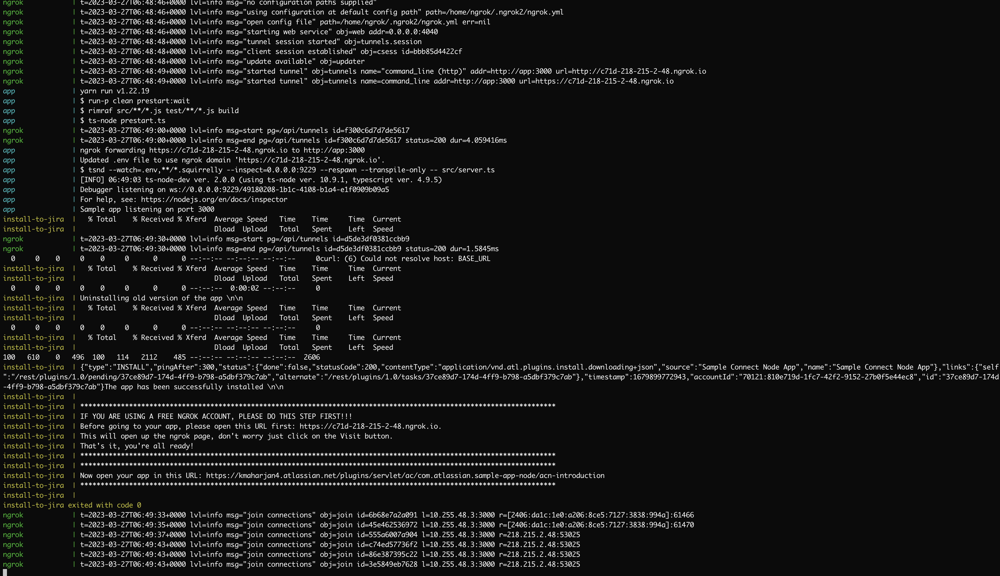

# Atlassian Connect Node Example App

## About
This repository contains an example [Express](https://expressjs.com/en/4x/api.html) server for building an [Atlassian Connect app](https://developer.atlassian.com/cloud/jira/platform/getting-started-with-connect/).
This app is aimed to help you to easily add your integration in Jira.

## Table of Contents
- [Pre-requisites](#pre-requisites)
- [Getting started](#getting-started)
- [Manual Install](#manually-installing-the-app)
- [Running your application](#running-your-application)
- [Testing](#testing)
- [Getting help](#getting-help)
- [License](#license)

## Pre-requisites
- [Node](https://nodejs.org)
- [yarn](https://yarnpkg.com/getting-started/install)(recommended) or npm
- [docker & docker-compose](https://docs.docker.com/engine/install/)
- [ngrok account](https://ngrok.com/)

## Getting started
You can run this app in 3 simple steps:
- **Installing dependencies** 
  - Run `yarn install` (recommended) or `npm install` for installing all the dependencies for this app.

- **Configuration**
  - We are using [ngrok](https://ngrok.com/docs/getting-started) for tunnelling. You'll need to create an ngrok 
    account to get access to the auth token.
  - Open your .env file and fill in *all the missing fields*

- **Running docker compose** 
  - Then simply run `docker-compose up`.
  - Please be patient as it will take a few minutes for everything to be setup. When everything is setup, you should see the URL in the terminal as in the picture below. 

> **Note:** _If you are using a free version of ngrok, please open the tunneled URL first. This needs to be done to bypass the ngrok browser warning. Just visit the ngrok warning page and just click on the Visit button._

At the very end, you can see the URL the index page of your app. Just open the URL and that's it, you're ready!

## Manually Installing the App
The above steps automatically installs the app, however you can only install one app at a time. 

If you want to install the app in multiple Jira instances, please do it manually. Go to your Jira instances and do 
the following steps:
- From the header menu, select Apps -> Manage your apps.
- Verify the filter is set to User-installed, and select Settings beneath the User-installed apps table.
- On the Settings pop-up, add Enable development mode and click Apply. Refresh the page.
- On the right side of the header, there should now appear a button Upload app. Click it and enter the app URL 
  `/atlassian-connect.json`(`https://${APP_URL}/atlassian-connect.json`)
- Click Upload.
- That's it! You're done. 🎉

## Testing
We have added a basic end to end test for installing and uninstalling the app, using [playwright](https://playwright.dev/docs/intro). You can add your own test cases on top of it. 

To run the end to end test, please add the values for `ATLASSIAN_URL`, `JIRA_ADMIN_EMAIL` and `JIRA_ADMIN_API_TOKEN` in the `.env` file. Then simply run `yarn test:e2e` in the terminal.

## Getting help
If you have feedback, found a bug or need some help, please create a [new issue in this repo](https://github.com/atlassian/atlassian-connect-example-app-node/issues/new/choose).

## License
The project is available as open source under the terms of the [MIT License](./LICENSE).
