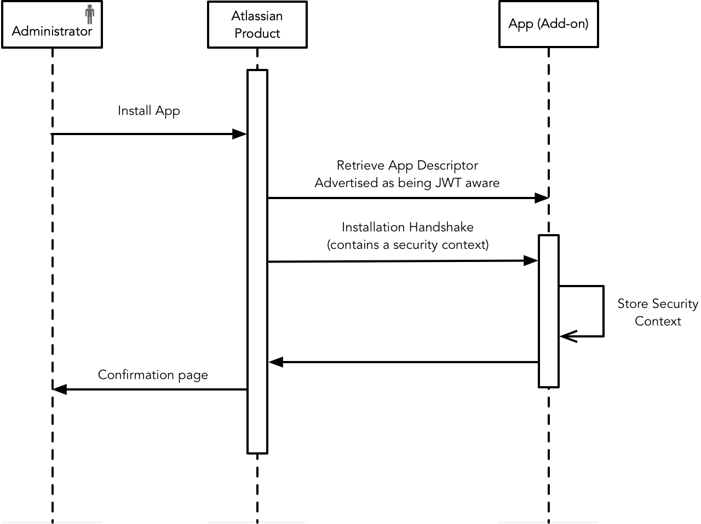

Atlassian Connect authenticates apps using JWT tokens. At installation time, the Connect app and the Atlassian host 
product exchange a security context containing an installation secret used to create and validate JWT tokens for use 
in API calls.

The use of JWT tokens guarantees that:

- The Atlassian application can verify it is talking to the app, and vice versa (authenticity).
- None of the query parameters of the HTTP request, nor the path (excluding the context path), nor the HTTP method, 
were altered in transit (integrity).

- **_JWT requires installed lifecycle event:_** For veritification of the JWT token to work, you need to have included the lifecycle event `installed` in your app descriptor.

## How to leverage Atlassian Connect's authentication feature:

1. Declare that the app uses JWT as the authentication mechanism in the app descriptor e.g.
```
 authentication: {
   type: 'jwt'
 },
```
2. Implement an installation callback endpoint, and add a reference to it in the app descriptor.
3. Use the security context to validate incoming requests (e.g. Webhooks), and sign outgoing requests (e.g. REST API calls to Jira).

> **authentication: none**
> If you have no security on your endpoints you have the option to set the authentication type to 'none' in your app descriptor. However, we strongly recommend you do not do this and instead set the type to 'jwt' as referenced above.


### Installation handshake

When an administrator installs the app in an Atlassian cloud instance, Connect initiates an "installation handshake" -  a way for 
the Atlassian application and the app to exchange keys stored on both sides for future API calls. 
This invokes the endpoint, passing a security context (this security context needs to be stored for future use). Some of what's 
contained in this security context include: 
- a `clientKey` for identifying the app
- a `sharedSecret` (used to create and validate JWT tokens). The shared secret can be up to 128 characters in length.



> **_NOTE:_**  The installation handshake only occurs when you are using the optional [lifecycle event](https://developer.atlassian.com/platform/forge/events-reference/life-cycle/) `installed`.

### Signing of the Lifecycle Callbacks

When JWT authentication is used the lifecycle callbacks are signed using a shared secret.

| Use Case  | 	Shared Secret used to Sign |
| --------- |--------------------------------------------------------------------------------------------------------------------------------------------------------------------------------------------------------------------------------------------------------------------------------------------|
| First install | None; no JWT token. Because there was no previous shared secret the recipient cannot validate a JWT token. |
| Second and subsequent installs | The shared secret sent in the preceding `installed` callback. |
| Uninstall, Enable and Disable | The shared secret sent in the preceding `installed` callback. |
| First install after being uninstalled | The shared secret sent in the preceding installed callback. This allows apps to allow the new installation to access previous tenant data (if any exists). A valid signature demonstrates that the sender is in possession of the shared secret from when the old tenant data was accessed. |

### Authentication how-to

**Creating the app descriptor**

For an Atlassian Connect app to authenticate securely with the host Atlassian product, it must advertise itself as being 
JWT aware, and provide a resource to receive important installation information. This is done by specifying the elements 
`authentication` and `lifecycle`. 

The `lifecycle:installed` property is a URL which is synchronously called by the Atlassian application when the app is 
installed.

For example:
```
{
    "baseUrl": "http://localhost:3000",
    "key": "atlassian-connect-addon",
    "authentication": {
        "type": "jwt"
    },
    "lifecycle": {
        "installed": "/add-on-installed-callback"
    }
    "modules": {} // etc
}
```

> **Incomplete registration**
> Upon successful registration, the app must return either a `200 OK` or `204 No Content` response code, otherwise the operation will fail and the installation will be marked as incomplete.

**Installation data**
When the app is installed, the Atlassian application invokes a callback endpoint exposed by the app. The request 
contains a payload with important tenant information that you will need to store in your app in order to sign
and verify future requests e.g.

```
{
  "key": "installed-addon-key",
  "clientKey": "unique-client-identifier",
  "sharedSecret": "a-secret-key-not-to-be-lost",
  "serverVersion": "server-version",
  "pluginsVersion": "version-of-connect",
  "baseUrl": "https://example.atlassian.net",
  "displayUrl": "https://docs.example.com",
  "productType": "jira",
  "description": "Atlassian Jira at https://example.atlassian.net",
  "serviceEntitlementNumber": "SEN-number",
  "eventType": "installed"
}
```

**Understanding JWT**
Knowledge of JWT is a prerequisite. Check out the [Understanding JWT](https://developer.atlassian.com/cloud/bitbucket/understanding-jwt-for-apps/) 
for apps page if you are unfamiliar with JWT.

For more details on how to create a JWT token, see [Creating a JWT Token](https://developer.atlassian.com/cloud/bitbucket/understanding-jwt-for-apps/#creating-a-jwt-token).

**Exposing a service**

All incoming requests (requests coming from an Atlassian product) should check for the presence of the `jwt` query 
string parameter, which needs to be decoded and verified. In particular, the verification should:
- Extract the JWT token from the request's `jwt` query parameter or the authorization header.
- Decode the JWT token, without verification. This gives you a header JSON object, a claims JSON object, and a signature.
- Extract the issuer ('iss') claim from the decoded, unverified claims object. This is the clientKey for the tenant - 
an identifier for the Atlassian application making the call, which should have been stored by the app as part of the 
installation handshake.
- Look up the `sharedSecret` for the `clientKey`, as stored by the app during the installation handshake.
- Verify the signature with the `sharedSecret` and the algorithm specified in the header's `alg` field.
- Verify the query has not been tampered by [Creating a Query Hash](https://developer.atlassian.com/cloud/bitbucket/query-string-hash) 
and comparing it against the qsh claim on the verified token.
- The JWT specification lists some [standard claims](https://datatracker.ietf.org/doc/html/draft-ietf-oauth-json-web-token-13#section-4.1.1) 
that, if present, you should verify. Issuers include these to help you ensure that tokens you receive are used according 
to the intentions of the issuer and with the best possible results.

These steps must be executed before processing the request, and the request must be rejected if any of these steps fail.

For more details on how to decode and validate a JWT token, see [Decoding and Verifying a JWT Token](https://developer.atlassian.com/cloud/bitbucket/understanding-jwt-for-apps/#decoding-and-verifying-a-jwt-token), 
which also provides a comprehensive list of claims supported by Atlassian products that you need to validate.

### Atlassian JWT libraries

In this example app, we use the [atlassian-jwt](https://www.npmjs.com/package/atlassian-jwt) library to create a middleware 
called `connectIframeJwtMiddleware`, which decodes the JWT token from Jira, verifies it and sets the `clientKey` in `res.locals`.
The tenant (Jira site) for each instance of the app is recognized based on this `clientKey`. Step by step, 
`connectIframeJwtMiddleware` is responsible for:
- injecting the Jira instance URL into the iframe url
- decoding JWT token without verification
- get the jira tenant associated with the url
- tries to verify the JWT token
- verify the query string hash
- save the jiraTenant to `res.locals` to be used later if all verifications pass

## Customer Specific Storage

When it comes to storing data for your authenticated Connect add-on, you have a couple of options:
- use the [add-on properties REST API](https://developer.atlassian.com/cloud/confluence/app-properties-api/)
- storing data with entity properties
  - [Jira](https://developer.atlassian.com/cloud/jira/platform/storing-data-with-entity-properties/)
  - [Confluence](https://developer.atlassian.com/cloud/confluence/confluence-entity-properties/)
